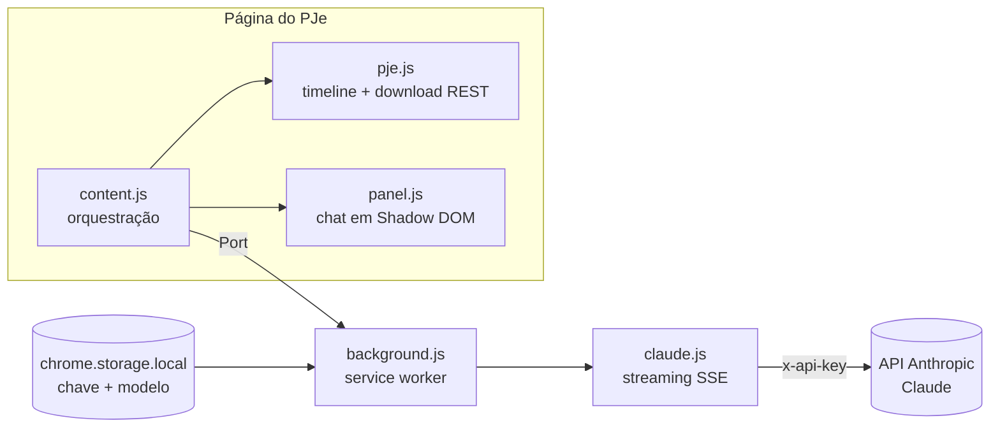

  

  
  
  
  

**PJe IA** é uma extensão Chrome que adiciona um assistente de IA à tela de autos digitais
do **PJe (Processo Judicial Eletrônico)**. Você marca as peças do processo, pergunta em
linguagem natural e o **Claude** responde com base no conteúdo real dos documentos —
resumos, linhas do tempo, partes, pedidos, provas — direto na página do processo, com a
interface na paleta visual do próprio PJe.

  

## 🎯 O que ele é — e o que ele não é

**PJe IA é um chat simplificado sobre os autos, não um agente autônomo.** Ele não navega
no processo sozinho: **você** seleciona as peças (pelos checkboxes ou digitando `@`) e, a
partir delas, faz perguntas, pedidos e gera documentos. A resposta usa somente os
documentos que você marcou — nada entra no contexto sem a sua escolha.

É um modelo diferente do de um **agente autônomo** — como o **Claude Code** ou agentes
construídos com a **Claude Agent SDK** e frameworks afins — que, conectado a um MCP
jurídico como o [TecJustiça](https://pjece.tecjustica.com/), decide sozinho quais peças
abrir, lê os autos por conta própria e gerencia o contexto automaticamente.

| | **PJe IA (esta extensão)** | **Agente autônomo + MCP** (Claude Code, Agent SDK…) |
|---|---|---|
| Quem escolhe as peças | **Você**, manualmente | O agente decide o que abrir e ler |
| Fluxo | Marcar peças → perguntar → resposta | Delegar a tarefa → o agente navega e itera sozinho |
| Contexto | Limitado à janela do modelo (medidor no rodapé) | Gerenciado automaticamente pelo agente |
| Ideal para | Consultas dirigidas, resumos, relatórios de peças escolhidas | Autos muito volumosos, tarefas abertas de investigação |
| Instalação | Extensão Chrome + chave da API | Ambiente de agente (CLI/SDK) + servidor MCP |

Os dois se complementam: para o dia a dia dentro do PJe, o chat manual é direto e
previsível (você sabe exatamente o que a IA leu); para autos gigantes ou tarefas de
investigação aberta, um agente com MCP é o caminho — o próprio painel sugere o
[TecJustiça MCP](https://pjece.tecjustica.com/) quando o contexto enche.

## ✨ Recursos

- **Chat sobre os autos** — converse com o Claude sobre as peças selecionadas, com histórico multi-turno.
- **Seleção de peças** — checkboxes por documento; só o que você marcar é enviado.
- **Busca na lista de peças** — filtro instantâneo por título, ignorando acentos; "todas" marca/desmarca só as peças visíveis no filtro.
- **PDF × HTML detectados automaticamente** — peças HTML têm o texto extraído localmente e vão como texto puro (fração do custo de um PDF); a detecção confere o content-type **e** a assinatura `%PDF-` do binário, então PDF mal-rotulado pelo servidor não vira lixo no contexto.
- **Menção com `@`** — digite `@` no campo de pergunta para buscar e marcar peças sem sair do teclado: filtro que ignora acentos (`@peticao` acha "Petição Inicial"), navegação por `↑↓`, `Enter` marca/desmarca, `Esc` fecha.
- **Peças categorizadas por cor** — decisões, atas/audiências, petições e provas ganham destaque automático na lista (regex sobre o título), com legenda no modo expandido.
- **Contexto sempre visível** — chips acima do campo mostram as peças marcadas (com `×` para remover), o contador indica `x/y no contexto`, e cada pergunta exibe quais peças foram anexadas naquele turno.
- **Progresso por peça** — ao preparar a análise, um card mostra o estado de cada peça (aguardando → baixando → pronta) com barra de progresso, e a resposta chega com indicador de digitação animado.
- **OCR nativo** — peças digitalizadas (imagem) são lidas pelo próprio Claude, sem OCR externo.
- **Respostas formatadas** — markdown completo: tabelas, listas, títulos e citações.
- **Citações pelo nome da peça** — cada PDF é enviado com o título da peça, para o modelo citar "na Contestação…" em vez de números de id.
- **Citações com página** — as afirmações vêm com marcadores `[n]` clicáveis e a lista de fontes ("Contestação, fl. 12") no rodapé de cada resposta.
- **Busca de jurisprudência** 🔍 — toggle que libera pesquisa em fontes oficiais (STF, STJ, Planalto, LexML…), com a consulta em andamento exibida em tempo real.
- **Gerar .docx** 📄 — relatório do processo em Word de verdade (skill oficial da Anthropic), baixado direto pelo navegador.
- **Streaming** — a resposta aparece em tempo real, com raciocínio do modelo em bloco colapsável.
- **Medidor de contexto** — barra mostra quanto da janela do modelo (tokens e páginas de PDF) a conversa já ocupa, atualizada em tempo real ao marcar/desmarcar peças (antes mesmo do envio), com alertas em 70% e 90%; desmarcar uma peça **libera contexto de verdade** no request seguinte.
- **Files API + anexo incremental** — cada peça sobe uma única vez; os turnos seguintes reaproveitam o que já está na conversa.
- **Modo expandido e tela cheia** — três tamanhos de painel para leitura confortável.
- **Exportar a conversa** — baixe o diálogo em `.md` ou copie cada resposta com um clique.
- **Prompt caching** — os PDFs anexados são cacheados pela API (~90% mais barato nos turnos seguintes).
- **Erros amigáveis** — chave inválida, conta sem crédito, limites e sobrecarga explicados em português.

## 🚀 Instalação

  

> A extensão ainda não está na Chrome Web Store — instale em modo desenvolvedor (leva 1 minuto):

1. **[Baixe o pje-ia.zip](https://github.com/marcosmarf27/pje-ia/releases/latest/download/pje-ia.zip)** (última versão) e **extraia** para uma pasta fixa (ex.: `Documentos\pje-ia`).
   - O Chrome carrega a extensão dessa pasta — não a apague depois.
2. Abra `chrome://extensions` e ative o **Modo do desenvolvedor** (canto superior direito).
3. Clique em **Carregar sem compactação** e selecione a pasta extraída (a que contém o `manifest.json`).
4. Clique no ícone **PJe IA** na barra do Chrome, cole sua chave da API da Anthropic e salve.
   - Não tem chave? O popup traz um **guia passo a passo** para criar a chave e adicionar crédito
     no [console.anthropic.com](https://console.anthropic.com).

**Para atualizar:** baixe o novo `.zip`, extraia por cima da mesma pasta e clique em **↺ Atualizar** em `chrome://extensions`. (Quem preferir pode continuar usando `git clone` + carregar a pasta do repositório.)

## 📖 Como usar

1. Faça login no PJe e abra os **autos de um processo** (tela da linha do tempo de documentos).
2. Clique no botão **⚖️ Analisar com IA** no canto inferior direito da página.
3. Marque as peças que quer incluir na análise — pela lista, ou digitando **`@`** no próprio campo de pergunta (ex.: `@contestação`).
4. Pergunte — por exemplo:
   - *"Resuma o pedido da inicial e os argumentos da contestação"*
   - *"Monte uma tabela com a linha do tempo dos atos"*
   - *"Quais provas foram juntadas e o que cada uma demonstra?"*

**Atalhos:** `@` cita peças no campo · `Enter` envia · `Shift+Enter` quebra linha · com o popup `@` aberto: `↑↓` navega, `Enter`/`Tab` marca, `Esc` fecha · botão `⤢` expande o painel · `↺` inicia nova conversa.

  

## 🏗️ Arquitetura

| Módulo | Papel |
|---|---|
| `src/pje.js` | Lista as peças na timeline e baixa cada uma pelo endpoint REST do PJe (sessão do usuário). Ativa peças "não abertas" automaticamente. |
| `src/panel.js` / `panel.css` | UI do chat em Shadow DOM (isolada do CSS do PJe): seletor de peças, menção `@`, chips de contexto, card de progresso e renderizador markdown próprio e seguro. |
| `src/content.js` | Orquestra: downloads paralelos, cache por peça, prompt caching, conversa multi-turno. |
| `src/background.js` + `claude.js` | Service worker que guarda a chave e chama a API da Anthropic com streaming. **A chave nunca é exposta à página.** |
| `src/popup.html` | Configuração em 1 clique no ícone da barra (chave, modelo, guia de primeiros passos). |

## 🔒 Privacidade e segurança

- A chave da API fica **somente** no `chrome.storage.local` do seu navegador (não sincroniza, não passa por servidores de terceiros).
- Os documentos marcados são enviados **diretamente à API da Anthropic** — nenhum outro serviço intermedia.
- A extensão só roda no domínio do PJe configurado e não coleta telemetria.

> ⚠️ **Aviso legal:** autos judiciais podem conter dados pessoais e sigilosos. O uso da
> extensão — e o envio de peças a um provedor de IA — é de responsabilidade do usuário,
> observadas as normas do tribunal, a LGPD e eventuais segredos de justiça. As respostas
> da IA são apoio à leitura, **não substituem** a análise jurídica humana.

## 🗺️ Roadmap

- [x] Files API para processos muito volumosos
- [x] Exportar a análise (copiar/.md/DOCX)
- [ ] Suporte a outros tribunais que usam PJe (TJs/TRFs/TRTs) via configuração de domínio
- [ ] Carregamento automático da timeline completa (peças fora da rolagem)
- [ ] Compaction para conversas muito longas
- [ ] Publicação na Chrome Web Store

## 🤝 Contribuindo

Issues e PRs são bem-vindos! Para bugs, inclua o tribunal/versão do PJe e a mensagem de
erro do painel (F12 → Console também ajuda).

## 📄 Licença

[MIT](LICENSE) © marcosmarf27

---

Feito com ⚖️ para quem lê autos o dia inteiro. Não afiliado ao CNJ nem à Anthropic.

