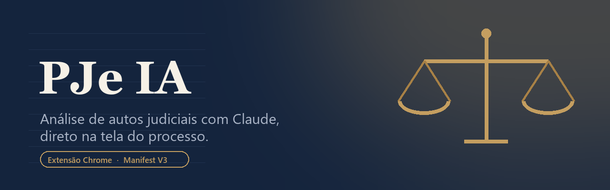
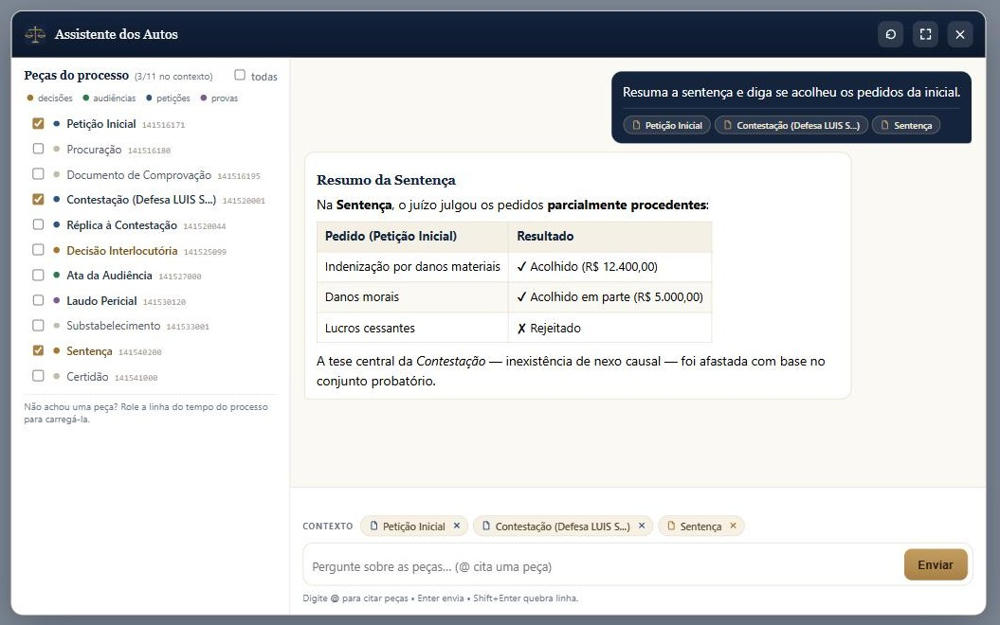
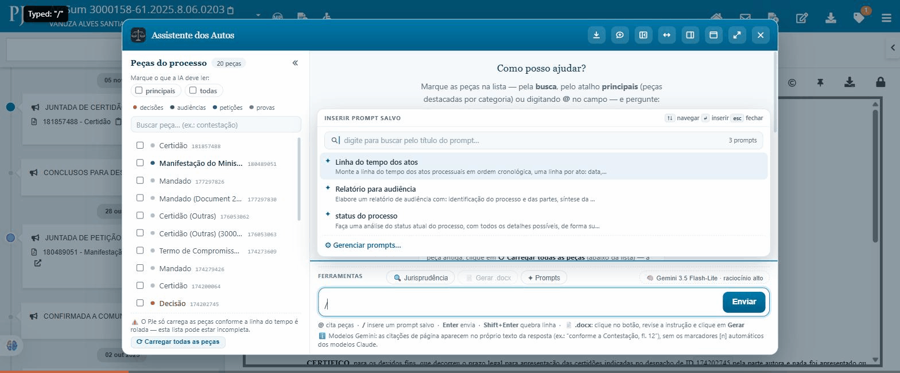
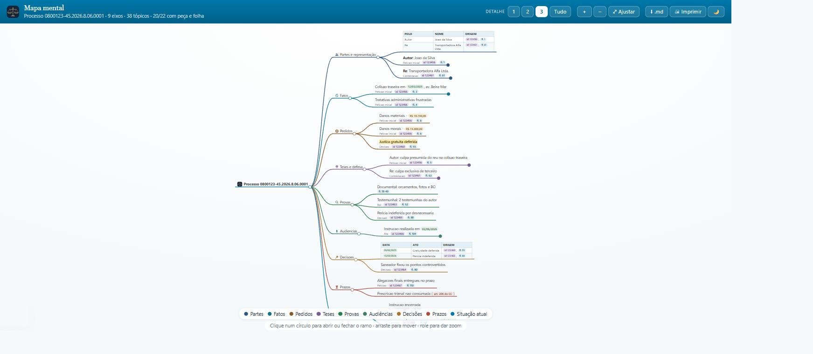
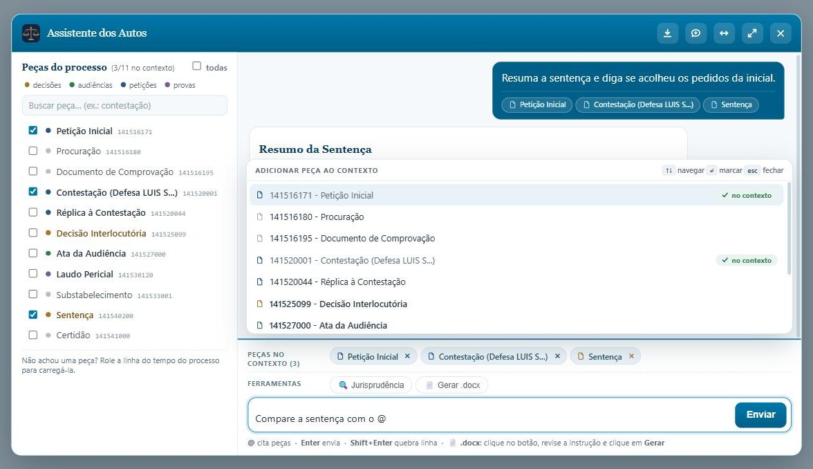
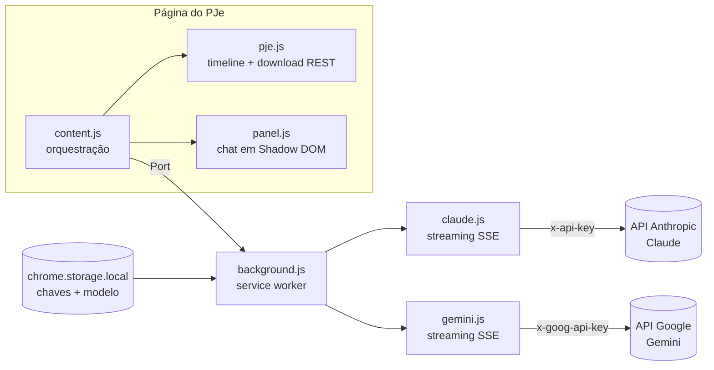

  

  
  
  
  
  

**PJe IA** é uma extensão Chrome que adiciona um assistente de IA à tela de autos digitais
do **PJe (Processo Judicial Eletrônico)**. Você marca as peças do processo, pergunta em
linguagem natural e o modelo — **Claude (Anthropic)** ou **Gemini (Google)**, à sua
escolha — responde com base no conteúdo real dos documentos — resumos, linhas do tempo,
partes, pedidos, provas — direto na página do processo, com a interface na paleta visual
do próprio PJe.

  

## 🎯 O que ele é — e o que ele não é

**PJe IA é um chat simplificado sobre os autos, não um agente autônomo.** Ele não navega
no processo sozinho: **você** seleciona as peças (pelos checkboxes ou digitando `@`) e, a
partir delas, faz perguntas, pedidos e gera documentos. A resposta usa somente os
documentos que você marcou — nada entra no contexto sem a sua escolha.

É um modelo diferente do de um **agente autônomo** — como o **Claude Code** ou agentes
construídos com a **Claude Agent SDK** e frameworks afins — que, conectado a um MCP
jurídico como o [TecJustiça MCP](https://mcp.tecjustica.com/) (demonstração com o PJe-CE
em [pjece.tecjustica.com](https://pjece.tecjustica.com/)), decide sozinho quais peças
abrir, lê os autos por conta própria e gerencia o contexto automaticamente.

| | **PJe IA (esta extensão)** | **Agente autônomo + MCP** (Claude Code, Agent SDK…) |
|---|---|---|
| Quem escolhe as peças | **Você**, manualmente | O agente decide o que abrir e ler |
| Fluxo | Marcar peças → perguntar → resposta | Delegar a tarefa → o agente navega e itera sozinho |
| Contexto | Limitado à janela do modelo (medidor no rodapé) | Gerenciado automaticamente pelo agente |
| Ideal para | Consultas dirigidas, resumos, relatórios de peças escolhidas | Autos muito volumosos, tarefas abertas de investigação |
| Instalação | Extensão Chrome + chave da API | Ambiente de agente (CLI/SDK) + servidor MCP |

Os dois se complementam: para o dia a dia dentro do PJe, o chat manual é direto e
previsível (você sabe exatamente o que a IA leu); para autos gigantes ou tarefas de
investigação aberta, um agente com MCP é o caminho — o próprio painel sugere o
[TecJustiça MCP](https://mcp.tecjustica.com/) quando o contexto enche.

## ✨ Recursos

### Conversa e modelos

- **Chat sobre os autos** — converse com o modelo sobre as peças selecionadas, com histórico multi-turno e streaming em tempo real (raciocínio do modelo em bloco colapsável).
- **Dois provedores de IA** — modelos **Claude (Anthropic)** e **Gemini (Google)** na mesma extensão: cadastre a chave do provedor que preferir (ou as duas) e troque de modelo nas opções. Ver a tabela [Qual modelo escolher?](#-qual-modelo-escolher) abaixo.
- **Selo do modelo ativo** — a barra de ferramentas mostra o modelo e o nível de raciocínio em uso (ex.: "Gemini 3.6 Flash · raciocínio alto"), atualizado na hora ao salvar as opções; clique nele para abrir a configuração.
- **Custo por resposta** — o rodapé estima o custo em US$ de cada resposta e o acumulado da conversa, calculado pela tabela de preços do provedor (com o desconto de cache).
- **Citações com página** *(modelos Claude)* — as afirmações vêm com marcadores `[n]` e a lista de fontes ("Contestação, fl. 12") no rodapé; nos modelos Gemini a citação vem no próprio texto ("conforme a Contestação, fl. 12").
- **Busca de jurisprudência** 🔍 — toggle que libera pesquisa na web (fontes oficiais: STF, STJ, Planalto, LexML…), com a consulta em andamento exibida em tempo real. Nos modelos Gemini usa o Google Search.
- **Gerar .docx** 📄 *(modelos Claude)* — relatório do processo em Word de verdade (skill oficial da Anthropic), baixado direto pelo navegador.
- **Mapa mental** 🧠 *(nos dois provedores)* — o modelo organiza as peças marcadas nos eixos da análise processual (partes, fatos, pedidos, teses, provas, audiências, decisões, prazos, situação) e a extensão abre um **mapa interativo** em nova aba (markmap): cada eixo com ícone e cor próprios, **tabelas** onde a informação é tabular, **pílulas** de folha, id da peça, data, valor e norma, e a origem (`peça · id · fl.`) em cada tópico. Nasce recolhido, com níveis de detalhe, zoom, tema escuro, impressão/PDF e download do texto em `.md`.
- **Biblioteca de prompts** ✦ — salve instruções que você repete (título + texto) e insira-as digitando **`/`** no início do campo: o prompt vira um chip elegante acima da caixa de texto e é enviado antes da sua mensagem. Gerenciamento (criar/editar/excluir) no botão **✦ Prompts**, e os prompts acompanham você em outros navegadores pela sincronização da conta Google.
- **OCR nativo** — peças digitalizadas (imagem) são lidas pelo próprio modelo, sem OCR externo.

### Seleção de peças

- **Checkboxes por documento** — só o que você marcar é enviado; chips acima do campo mostram as peças no contexto (com `×` para remover) e o contador indica `x/y`.
- **Atalho "principais"** — marca com um clique só as peças destacadas por categoria (decisões, audiências, petições e provas): o essencial da análise processual. "todas" marca a lista inteira; os dois respeitam a busca ativa.
- **Peças categorizadas por cor** — decisões (dourado), audiências (verde), petições (azul) e provas (violeta) ganham destaque automático, com vocabulário criminal (inquérito, flagrante, interrogatório, pronúncia…) e cível (reconvenção, acordo, quesitos…).
- **Busca na lista** — filtro instantâneo por título, ignorando acentos.
- **Menção com `@`** — digite `@` no campo de pergunta para buscar e marcar peças sem sair do teclado (`↑↓` navega, `Enter` marca, `Esc` fecha).
- **⟳ Carregar todas as peças** — o PJe só carrega os documentos conforme a linha do tempo é rolada; o botão rola tudo automaticamente para a lista ficar completa.
- **Preview no hover** — nos modos largos, passar o mouse numa peça abre a pré-visualização do PDF/texto; "Abrir documento" busca peças ainda não carregadas.
- **Ver na timeline** — cada peça tem um botão que localiza e destaca o documento na linha do tempo do PJe.

### Contexto, custo e confiabilidade

- **Medidor de contexto dinâmico** — barra mostra quanto da janela do modelo (tokens e páginas de PDF) a conversa ocupa, atualizada ao marcar/desmarcar peças **antes mesmo do envio**, com alertas em 70% e 90%. Desmarcar uma peça **libera contexto de verdade** no request seguinte.
- **Files API + anexo incremental** — cada peça sobe uma única vez; os turnos seguintes reaproveitam o que já está na conversa.
- **Cache automático** — os PDFs anexados são cacheados pela API (~90% mais barato nos turnos seguintes), nos dois provedores.
- **Retry automático** — sobrecarga da API, limites momentâneos e quedas de conexão no meio do streaming são re-tentados sozinhos, sem duplicar texto na tela.
- **PDF × HTML detectados automaticamente** — peças HTML viram texto puro (fração do custo de um PDF); a detecção confere o content-type **e** a assinatura `%PDF-` do binário.
- **Erros amigáveis** — chave inválida, conta sem crédito, limites e sobrecarga explicados em português.

### Interface

- **Quatro modos de painel** — flutuante, expandido, tela cheia e **lateral** (o processo fica visível e clicável ao lado do chat).
- **Ocultar a lista de peças** — nos modos expandido/tela cheia, um botão no cabeçalho colapsa a coluna de documentos para dar todo o espaço ao chat (a seleção continua valendo).
- **Progresso por peça** — card com o estado de cada peça (aguardando → baixando → pronta) ao preparar a análise.
- **Respostas formatadas** — markdown completo: tabelas, listas, títulos e citações.
- **Exportar a conversa** — baixe o diálogo em `.md` ou copie cada resposta com um clique.

## 🧠 Qual modelo escolher?

| Modelo | Janela / PDF | Preço (US$/1M tokens) | Perfil |
|---|---|---|---|
| **Claude Haiku 4.5** (padrão) | 200 mil / 100 págs. | 1 / 5 | Rápido e barato; todos os recursos (citações `[n]`, .docx) |
| **Claude Sonnet 5** | 1M / 600 págs. | 3 / 15 | Autos volumosos com todos os recursos |
| **Claude Opus 4.8** | 1M / 600 págs. | 5 / 25 | Qualidade superior para análises delicadas |
| **Claude Fable 5** | 1M / 600 págs. | 10 / 50 | O mais capaz — e o mais caro e lento |
| **Gemini 3.6 Flash** | 1M / 1000 págs. | 1,50 / 7,50 | Rápido e multimodal, ótimo custo para autos grandes |
| **Gemini 3.5 Flash-Lite** | 1M / 1000 págs. | 0,30 / 2,50 | O mais barato e veloz — triagens e resumos |

> Nos modelos Gemini, as citações de página vêm no próprio texto (sem os marcadores `[n]` clicáveis) e a geração de .docx fica indisponível — esses recursos usam a API da Anthropic. Trocar entre Claude e Gemini no meio de uma conversa pede "Nova conversa".

## 🚀 Instalação

  

> A extensão ainda não está na Chrome Web Store — instale em modo desenvolvedor (leva 1 minuto):

1. **[Baixe o pje-ia.zip](https://github.com/marcosmarf27/pje-ia/releases/latest/download/pje-ia.zip)** (última versão) e **extraia** para uma pasta fixa (ex.: `Documentos\pje-ia`).
   - O Chrome carrega a extensão dessa pasta — não a apague depois.
2. Abra `chrome://extensions` e ative o **Modo do desenvolvedor** (canto superior direito).
3. Clique em **Carregar sem compactação** e selecione a pasta extraída (a que contém o `manifest.json`).
4. Clique no ícone **PJe IA** na barra do Chrome, cole sua chave de API — da **Anthropic**
   (modelos Claude) e/ou do **Google** (modelos Gemini) — escolha o modelo e salve.
   - Não tem chave? O popup traz um **guia passo a passo** para criar a chave: Anthropic no
     [console.anthropic.com](https://console.anthropic.com), Google no
     [aistudio.google.com](https://aistudio.google.com/apikey).

**Para atualizar:** baixe o novo `.zip`, extraia por cima da mesma pasta e clique em **↺ Atualizar** em `chrome://extensions`. (Quem preferir pode continuar usando `git clone` + carregar a pasta do repositório.)

## 📖 Como usar

1. Faça login no PJe e abra os **autos de um processo** (tela da linha do tempo de documentos).
2. Clique no botão **⚖️ Analisar com IA** no canto inferior direito da página.
3. Clique em **⟳ Carregar todas as peças** (abaixo da lista) — o PJe só carrega os documentos conforme a linha do tempo é rolada; sem esse passo a lista pode estar incompleta.
4. Marque as peças da análise — o atalho **principais** seleciona as destacadas por categoria de uma vez; a busca e o **`@`** no campo acham peças pelo nome (ex.: `@contestação`).
5. Pergunte — por exemplo:
   - *"Resuma o pedido da inicial e os argumentos da contestação"*
   - *"Monte uma tabela com a linha do tempo dos atos"*
   - *"Quais provas foram juntadas e o que cada uma demonstra?"*
6. Siga a conversa: **adicionar** peças no meio é barato (aproveita o cache); para **remover** várias ou mudar de assunto, prefira **⟲ Nova conversa**. O medidor e o custo ficam no rodapé; o selo mostra o modelo ativo.

**Atalhos:** `@` cita peças no campo · `/` insere um prompt salvo · `Enter` envia · `Shift+Enter` quebra linha · com os popups `@` e `/` abertos: `↑↓` navega, `Enter`/`Tab` seleciona, `Esc` fecha · botões do cabeçalho: `⇄` painel largo, `▯` lateral, `⤢` tela cheia, `▤` oculta/exibe a lista de peças (modos largos), `↺` nova conversa.

### ✦ Prompts salvos: escreva a instrução uma vez, use sempre

Aquelas instruções que você repete em todo processo (relatório de audiência, linha do
tempo dos atos, análise de prescrição) viram **prompts salvos**. Digite **`/`** no
início do campo de mensagem, busque pelo título e selecione: o prompt entra como um
**chip** acima da caixa de texto — passe o mouse nele para reler o texto completo — e é
enviado antes do que você escrever na hora. Para criar, editar ou excluir, use o botão
**✦ Prompts** na barra de ferramentas (ou a linha *Gerenciar prompts…* do próprio
popup). Eles ficam no `chrome.storage.sync`, então acompanham você em qualquer Chrome
logado na mesma conta Google.

  

### 🧠 Mapa mental: o processo inteiro numa página

Quando o que você precisa é **enxergar a estrutura** do feito — e não ler mais um
relatório —, marque as peças e clique em **🧠 Mapa mental**. A instrução padrão
(editável, como no `.docx`) aparece no campo e o botão Enviar vira **Gerar mapa**;
a resposta abre em **nova aba** como um mapa interativo, com o número do processo no
centro e um ramo por eixo (partes, fatos, pedidos, teses, provas, situação atual).

O mapa nasce **recolhido**: clique num círculo para abrir o ramo, use os botões de
**detalhe 1/2/3/Tudo** para abrir vários de uma vez, arraste para mover, role para
dar zoom. Cada eixo tem ícone e cor próprios (a mesma paleta das categorias de peças),
e o que é tabular — partes, linha do tempo — vira **tabela** dentro do nó. Folhas,
ids de peça, datas, valores e artigos ganham **destaque colorido**.

**Toda afirmação aponta a origem**: cada tópico traz, em linha própria, a peça, o
**id do documento** (o número que abre o título da peça na timeline do PJe) e a
**folha** — é assim que você reencontra o trecho nos autos. O cabeçalho mostra
quantos tópicos vieram com peça e folha. Ainda dá para alternar o **tema escuro**,
baixar o texto em **`.md`** e **imprimir** (ou salvar em PDF, já enquadrado).

> Diferente do `.docx`, o mapa mental funciona **nos dois provedores** — Claude e
> Gemini —, porque não depende de execução de código no servidor da Anthropic.
> Os mapas gerados ficam disponíveis enquanto o navegador estiver aberto.

  

### 🏛️ Todos os tribunais, sem configurar nada

A extensão funciona em **qualquer tribunal que rode PJe** (TJs, TRFs, TRTs — 1º ou 2º
grau, incluindo o PJe na nuvem do CNJ em `*.cloud.pje.jus.br`), automaticamente: a
permissão cobre todos os sites da Justiça (`https://*.jus.br`) desde a instalação.
O botão **⚖️ Analisar com IA** aparece sozinho quando você abre a tela de autos
digitais de um processo — em páginas que não são de autos (login, portais), a
extensão não injeta nada.

> A compatibilidade depende de o tribunal usar a tela de autos padrão do PJe
> (linha do tempo + endpoint de download `pje-legacy`) — o caso da grande maioria
> das instalações do CNJ.

  

## 🏗️ Arquitetura

| Módulo | Papel |
|---|---|
| `src/pje.js` | Lista as peças na timeline e baixa cada uma pelo endpoint REST do PJe (sessão do usuário). Ativa peças "não abertas" automaticamente. |
| `src/panel.js` / `panel.css` | UI do chat em Shadow DOM (isolada do CSS do PJe): seletor de peças, menção `@`, prompts salvos `/`, chips de contexto, card de progresso e renderizador markdown próprio e seguro. |
| `src/prompts.js` | Biblioteca de prompts do usuário: CRUD no `chrome.storage.sync` (um item por prompt), sincronizado entre os navegadores da mesma conta Google. |
| `src/content.js` | Orquestra: downloads paralelos, cache por peça, prompt caching, conversa multi-turno. |
| `src/background.js` + `claude.js` / `gemini.js` | Service worker que guarda as chaves e chama a API do provedor do modelo escolhido (Anthropic ou Google) com streaming. **As chaves nunca são expostas à página.** |
| `src/mapa.html` + `mapa.js` / `mapa.css` | Página do **mapa mental**: converte o Markdown da resposta em árvore de nós (com ícones por eixo, tabelas e realces de fl./id) e desenha com markmap (d3), em aba própria da extensão. |
| `vendor/` | `d3.min.js` e `markmap-view.js` oficiais, sem modificação, usados **só** pela página do mapa (nunca carregados nas páginas do PJe). Licenças em `vendor/LICENSES.md`. |
| `src/popup.html` | Configuração em 1 clique no ícone da barra (chave, modelo, guia de primeiros passos). |

## 🔒 Privacidade e segurança

- As chaves de API ficam **somente** no `chrome.storage.local` do seu navegador (não sincronizam, não passam por servidores de terceiros).
- Os documentos marcados são enviados **diretamente à API do provedor do modelo escolhido** (Anthropic ou Google) — nenhum outro serviço intermedia.
- A extensão só roda em sites da Justiça (`*.jus.br`), só injeta o painel em telas de autos do PJe e não coleta telemetria.
- Política completa em [PRIVACY.md](PRIVACY.md) — sem servidor próprio, sem analytics, o desenvolvedor nunca tem acesso a nenhum dado.

> ⚠️ **Aviso legal:** autos judiciais podem conter dados pessoais e sigilosos. O uso da
> extensão — e o envio de peças a um provedor de IA — é de responsabilidade do usuário,
> observadas as normas do tribunal, a LGPD e eventuais segredos de justiça. As respostas
> da IA são apoio à leitura, **não substituem** a análise jurídica humana.

## 🗺️ Roadmap

- [x] Files API para processos muito volumosos
- [x] Exportar a análise (copiar/.md/DOCX)
- [x] Suporte a outros tribunais que usam PJe (TJs/TRFs/TRTs) — automático em qualquer `*.jus.br`
- [x] Carregamento automático da timeline completa (peças fora da rolagem)
- [x] Segundo provedor de IA — Google Gemini (3.6 Flash / 3.5 Flash-Lite)
- [x] Preview de peças, modo lateral e "ver na timeline"
- [x] Mapa mental interativo das peças (markmap), nos dois provedores
- [x] Biblioteca de prompts do usuário (`/` no campo, sincronizada entre navegadores)
- [ ] Compaction para conversas muito longas
- [ ] Limpeza de uploads antigos na Files API
- [ ] Publicação na Chrome Web Store — **enviada para análise em 21/07/2026** (aguardando revisão)

## 🤝 Contribuindo

Issues e PRs são bem-vindos! Para bugs, inclua o tribunal/versão do PJe e a mensagem de
erro do painel (F12 → Console também ajuda).

## 📄 Licença

[MIT](LICENSE) © marcosmarf27

---

Feito com ⚖️ para quem lê autos o dia inteiro. Não afiliado ao CNJ, à Anthropic nem ao Google.

